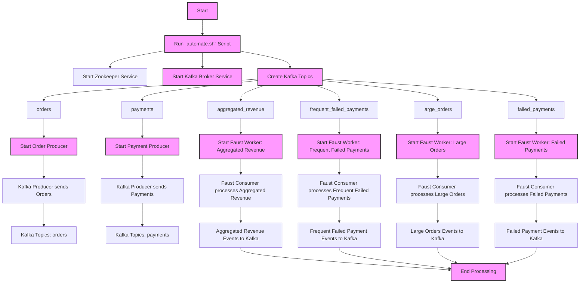

# Project Overview: Kafka-based Order Payment Processing System with Faust and KSQL

**Purpose:**
This project is designed to process, analyze, and monitor order and payment events in real-time using Kafka, Faust, and KSQL. The system is aimed at processing order and payment streams, detecting large or failed payments, aggregating user revenue, and identifying frequent failed payment patterns. The goal is to implement an end-to-end solution for real-time data processing, transformation, and monitoring of events related to e-commerce orders and payments.

***
## Architecture:
The architecture of this project includes several components:

***

### Project Overview:
The Kafka-based Order Payment Processing System consists of the following components:

1. **Kafka Broker**:
   - Acts as the central messaging platform to exchange messages between Kafka Producers and Consumers.
   
2. **Zookeeper**:
   - Coordinates and manages Kafka brokers.
   
3. **Kafka Topics**:
   - `orders`, `payments`, `failed_payments`, `aggregated_revenue`, `large_orders`, and `frequent_failed_payments` are the main Kafka topics where the messages (events) are streamed to and from.
   
4. **Kafka Producers**:
   - `order_producer.py` and `payment_producer.py` simulate real-time order and payment events and push them to the respective Kafka topics.
   
5. **Faust Workers**:
   - These workers are responsible for processing messages from Kafka topics, performing necessary operations like aggregating revenues, detecting failed payments, and more. 
   - Each worker listens to a specific Kafka topic and processes messages accordingly.
   
6. **KSQL**:
   - KSQL is used for real-time stream processing and querying the data from Kafka topics.
   
7. **`automate.sh` Script**:
   - A single script to start all necessary services:
     - Zookeeper
     - Kafka Broker
     - Kafka Topics creation
     - Kafka Producers (Order, Payment, User)
     - Faust Workers (Processing Orders, Payments, Aggregating Revenue, Detecting Failed Payments, and Large Orders)

### Architecture Flow:
1. **Run the `automate.sh` script**:
   - Initializes Zookeeper and Kafka Broker services.
   - Deletes and re-creates all necessary Kafka topics (`orders`, `payments`, `users`, `failed_payments`, `aggregated_revenue`, `large_orders`, `frequent_failed_payments`).
   - Starts the Kafka Producers (`order_producer.py`, `payment_producer.py`, `user_producer.py`).
   - Starts the Faust Workers to consume and process messages from Kafka topics.
   
2. **Kafka Producers**:
   - These producers generate random data for orders, payments, and user activities and send them to the respective Kafka topics.
   
3. **Kafka Consumers (Faust Workers)**:
   - Faust workers process the incoming data from Kafka, such as detecting failed payments, calculating aggregated revenue, identifying large orders, and tracking frequent failed payments.
   - The workers send processed data back into Kafka for further consumption or analysis.

### Key Benefits:
- **Scalability**: The use of Kafka topics with partitioning ensures that the system can scale as needed, handling high volumes of data efficiently.
- **Real-Time Processing**: The integration of Faust and KSQL allows for real-time data streaming and processing.
- **Modularity**: Each component (order processing, payment processing, user event tracking, etc.) is modular, allowing for easier maintenance and extension of the system.

